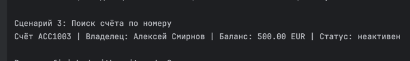

# ЛР-2 — Коллекция объектов

## Тема
Реализация контейнера объектов для предметной области «Банковский счёт».

## Файлы
- `model.py` — класс `BankAccount`
- `collection.py` — класс `BankAccountCollection`
- `demo.py` — демонстрация работы
- `validate.py` — функции валидации

## Реализовано

- `add(item)` — добавление объекта (через проверку `isinstance` и список `list.append`)
- `remove(item)` — удаление объекта (через `list.remove`)
- `remove_at(index)` — удаление по индексу (через `list.pop`)
- `get_all()` — получение всех объектов (через копию списка `list.copy`)

- `find_by_account_number()` — поиск по номеру (через перебор `for`)
- `find_by_owner_name()` — поиск по имени (через перебор `for`)

- `len(collection)` — получение количества элементов (через `__len__`)
- `for item in collection` — итерация (через `__iter__` → `iter(list)`)
- `collection[index]` — индексация (через `__getitem__`)

- запрет дубликатов — (через проверку `find_by_account_number` перед добавлением)

- `sort(key)` — универсальная сортировка (через `list.sort`)
- `sort_by_owner_name()` — сортировка по имени (через `lambda`)
- `sort_by_balance()` — сортировка по балансу (через `lambda`)

- `get_active()` — фильтрация активных (через создание новой коллекции + `for`)
- `get_inactive()` — фильтрация неактивных (через создание новой коллекции + `for`)
- `get_with_balance_more_than()` — фильтрация по балансу (через `for` + условие)
---

## Сценарии использования

### Сценарий 1: Получение активных счетов
Пользователь хочет получить список всех активных банковских счетов.


Действия:
- создаётся коллекция счетов
- вызывается метод `get_active()`
- возвращается новая коллекция только с активными счетами

---

### Сценарий 2: Сортировка счетов по балансу
Пользователь хочет отсортировать счета по сумме денег.


Действия:
- вызывается метод `sort_by_balance()`
- счета сортируются по возрастанию или убыванию

---

### Сценарий 3: Поиск счёта по номеру
Пользователь ищет конкретный счёт по его номеру.





Действия:
- вызывается `find_by_account_number()`
- если счёт найден — возвращается объект
- если нет — возвращается `None`

---

## Запуск
```bash
python demo.py