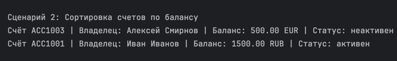

# ЛР-2 — Коллекция объектов

## Тема
Реализация контейнера объектов для предметной области «Банковский счёт».

## Файлы
- `model.py` — класс `BankAccount`
- `collection.py` — класс `BankAccountCollection`
- `demo.py` — демонстрация работы
- `validate.py` — функции валидации

## Реализовано
- добавление объекта
- удаление объекта
- удаление по индексу
- получение всех объектов
- проверка типа объекта
- поиск по номеру счёта
- поиск по владельцу
- поддержка `len()`
- поддержка итерации `for`
- поддержка индексации
- запрет дубликатов по номеру счёта
- сортировка по имени владельца
- сортировка по балансу
- фильтрация активных счетов
- фильтрация неактивных счетов
- фильтрация по размеру баланса

---

## Сценарии использования

### Сценарий 1: Получение активных счетов
Пользователь хочет получить список всех активных банковских счетов.





Действия:
- создаётся коллекция счетов
- вызывается метод `get_active()`
- возвращается новая коллекция только с активными счетами

---

### Сценарий 2: Сортировка счетов по балансу
Пользователь хочет отсортировать счета по сумме денег.


Действия:
- вызывается метод `sort_by_balance()`
- счета сортируются по возрастанию или убыванию

---

### Сценарий 3: Поиск счёта по номеру
Пользователь ищет конкретный счёт по его номеру.

Действия:
- вызывается `find_by_account_number()`
- если счёт найден — возвращается объект
- если нет — возвращается `None`

---

## Запуск
```bash
python demo.py