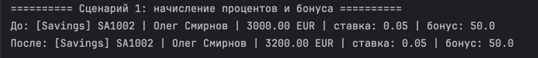
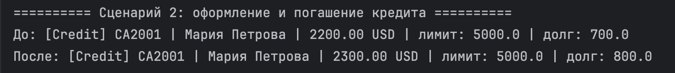
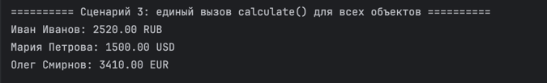

# Лабораторная работа №3 — Наследование и иерархия классов

## 1. Цель работы

Освоить механизм наследования классов, научиться строить иерархию объектов, переиспользовать код базового класса и переопределять методы. Изучить полиморфизм и работу с объектами разных типов через базовый класс.

## 2. Описание реализованной иерархии классов

В лабораторной работе реализована следующая иерархия:

BankAccount
├── SavingsAccount
└── CreditAccount

### Базовый класс BankAccount

BankAccount — базовый класс банковского счёта, который содержит общий функционал для всех типов счетов.

Атрибуты:
- _owner_name — имя владельца счёта
- _account_number — номер счёта
- _balance — баланс счёта
- _currency — валюта счёта
- _is_active — активность счёта

Методы:
- deposit(amount) — пополнение счёта
- withdraw(amount) — снятие средств
- can_withdraw(amount) — проверка возможности снятия средств
- activate() — активация счёта
- deactivate() — деактивация счёта
- calculate() — общий полиморфный метод расчёта
- __str__() — строковое представление объекта
- __repr__() — техническое представление объекта
- __eq__() — сравнение объектов по номеру счёта

### Дочерний класс SavingsAccount

SavingsAccount — накопительный счёт, наследуется от BankAccount.

Новые атрибуты:
- interest_rate — процентная ставка
- bonus — бонус

Новые методы:
- apply_interest() — начисление процентов на баланс
- add_bonus() — начисление бонуса

Переопределённые методы:
- calculate() — рассчитывает итоговую сумму с учётом процентов и бонуса
- __str__() — выводит расширенную информацию о накопительном счёте

### Дочерний класс CreditAccount

CreditAccount — кредитный счёт, наследуется от BankAccount.

Новые атрибуты:
- credit_limit — кредитный лимит
- debt — текущий долг

Новые методы:
- take_credit(amount) — оформление кредита
- repay_credit(amount) — погашение кредита

Переопределённые методы:
- calculate() — рассчитывает доступный остаток с учётом долга
- __str__() — выводит расширенную информацию о кредитном счёте

### Различия между классами

| Класс | Баланс | Расчёт | Особенности |
|-------|--------|--------|-------------|
| BankAccount | >= 0 | возвращает баланс | общий функционал |
| SavingsAccount | >= 0 | баланс + проценты + бонус | накопительный счёт |
| CreditAccount | >= 0 | баланс - долг | кредитный лимит и задолженность |

## 3. Работа с коллекцией

В лабораторной работе используется класс BankAccountCollection, разработанный в ЛР-2 и адаптированный для хранения объектов разных типов, если они наследуются от BankAccount.

Возможности коллекции:
- хранение объектов BankAccount, SavingsAccount, CreditAccount
- добавление объектов в коллекцию
- удаление объектов из коллекции
- поиск счёта по номеру
- итерация по коллекции
- индексация
- фильтрация по типу объектов
- фильтрация активных объектов

Основные методы коллекции:
- add(item) — добавить объект
- remove(item) — удалить объект
- get_all() — получить все объекты
- find_by_account_number(account_number) — поиск по номеру счёта
- get_savings_accounts() — получить только накопительные счета
- get_credit_accounts() — получить только кредитные счета
- get_active() — получить только активные счета
- __len__() — количество объектов
- __iter__() — итерация по объектам
- __getitem__() — доступ по индексу

## 4. Полиморфизм

Полиморфизм реализован через метод calculate().

Поведение метода calculate():
- у BankAccount возвращает текущий баланс
- у SavingsAccount возвращает баланс с учётом процентов и бонуса
- у CreditAccount возвращает баланс с учётом долга

Полиморфизм реализован без использования условных конструкций вида if type == ... при вызове метода.

Пример полиморфного вызова:

for account in accounts:
    print(account.calculate())

## 5. Демонстрация работы

### Сценарий 1: Начисление процентов и бонуса

Демонстрируется работа объекта SavingsAccount.

Показывается:
- вывод состояния счёта до изменений
- вызов метода apply_interest() для начисления процентов
- вызов метода add_bonus() для начисления бонуса
- изменение баланса после выполнения операций

В данном сценарии демонстрируется использование дочерних методов накопительного счёта и изменение состояния объекта после их вызова.

### Сценарий 2: Оформление и погашение кредита

Демонстрируется работа объекта CreditAccount.

Показывается:
- вывод состояния счёта до изменений
- вызов метода take_credit() для оформления кредита
- вызов метода repay_credit() для частичного погашения задолженности
- изменение баланса и долга после выполнения операций

В данном сценарии демонстрируется использование дочерних методов кредитного счёта и работа с кредитной задолженностью.

### Сценарий 3: Единый вызов calculate() для всех объектов

Создаётся коллекция BankAccountCollection, содержащая объекты разных типов:
- SavingsAccount
- CreditAccount

Демонстрируется:
- хранение объектов разных классов в одной коллекции
- единый вызов метода calculate() для всех объектов
- разное поведение метода calculate() в зависимости от типа объекта
- полиморфный подход к обработке объектов через общий интерфейс

Дополнительно в demo.py показаны:
- использование базовых методов deposit() и withdraw()
- использование дочерних методов apply_interest() и take_credit()
- проверка типов через isinstance()
- фильтрация коллекции:
  - только накопительные счета
  - только кредитные счета
  - только активные счета

Скриншоты работы программы размещаются в папке images/lab03/.

## 6. Вывод

В ходе выполнения лабораторной работы были изучены:
- наследование классов
- использование базового и дочерних классов
- вызов конструктора базового класса через super()
- добавление новых атрибутов и методов в дочерние классы
- переопределение методов
- полиморфизм
- работа коллекции с объектами разных типов
- фильтрация объектов по типу и по состоянию