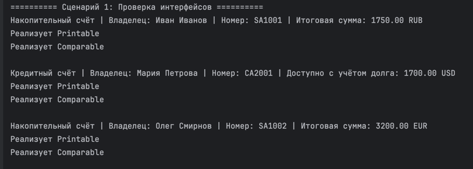
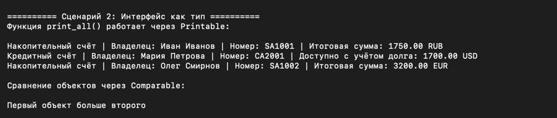
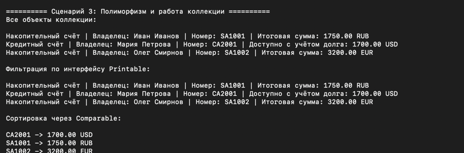

# Лабораторная работа №4 — Интерфейсы и абстрактные классы

## Цель работы

Изучить:
- абстрактные базовые классы (ABC)
- интерфейсы как контракты поведения
- полиморфизм через интерфейсы
- универсальную работу с объектами разных типов

---

# Описание интерфейсов

## Интерфейс Printable

Интерфейс Printable требует реализацию метода:

```python
to_string()
```

Метод возвращает строковое представление объекта.

---

## Интерфейс Comparable

Интерфейс Comparable требует реализацию метода:

```python
compare_to(other)
```

Метод сравнивает объекты:
- `1` — текущий объект больше
- `-1` — текущий объект меньше
- `0` — объекты равны

---

# Реализация интерфейсов в классах

Интерфейсы реализуют классы:

- SavingsAccount
- CreditAccount

Оба класса:
- наследуются от BankAccount
- реализуют Printable
- реализуют Comparable

---

## SavingsAccount

### Реализованные методы интерфейсов

### Printable
```python
to_string()
```

Возвращает строку с:
- владельцем
- номером счёта
- итоговой суммой с учётом процентов и бонуса

### Comparable
```python
compare_to(other)
```

Сравнивает счета по результату метода:

```python
calculate()
```

---

## CreditAccount

### Реализованные методы интерфейсов

### Printable
```python
to_string()
```

Возвращает строку с:
- владельцем
- номером счёта
- доступной суммой с учётом долга

### Comparable
```python
compare_to(other)
```

Сравнивает счета по результату метода:

```python
calculate()
```

---

# Демонстрация работы

## Сценарий 1: Проверка интерфейсов

### Что происходит:
- создаются объекты разных классов
- вызывается метод `to_string()`
- выполняется проверка:
```python
isinstance(obj, Printable)
```
и:
```python
isinstance(obj, Comparable)
```

### Что показывает:
- оба класса реализуют несколько интерфейсов
- каждый класс имеет собственную реализацию методов интерфейсов
- интерфейсы работают как контракты поведения

---

## Сценарий 2: Интерфейс как тип


### Что происходит:
Создаётся универсальная функция:

```python
print_all(items: list[Printable])
```

Функция работает с любыми объектами, реализующими интерфейс Printable.

Также выполняется сравнение объектов через интерфейс Comparable.

### Что показывает:
- функция не зависит от конкретного класса
- используется полиморфизм через интерфейс
- код работает с поведением объектов, а не с их типами

---

## Сценарий 3: Полиморфизм и работа коллекции

### Что происходит:
- коллекция хранит объекты разных типов
- выполняется фильтрация:
```python
get_printable()
```
- выполняется сортировка:
```python
sort_by_compare()
```
- вызывается:
```python
to_string()
```
для всех объектов

### Что показывает:
- коллекция работает через интерфейсы
- полиморфизм реализован без условий:
```python
if isinstance(...)
```
- один вызов метода даёт разное поведение у разных объектов

---

# Вывод

В ходе лабораторной работы были изучены:
- абстрактные классы
- ABC
- abstractmethod
- интерфейсы
- контракты поведения
- множественная реализация интерфейсов
- использование интерфейса как типа
- полиморфизм через интерфейсы
- работа коллекции через интерфейсы
- сортировка и фильтрация через общий контракт поведения