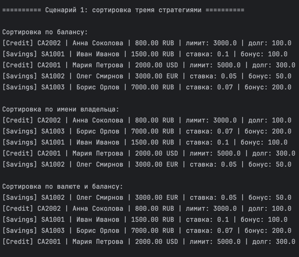
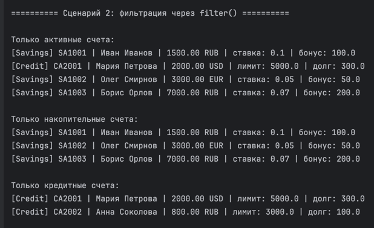
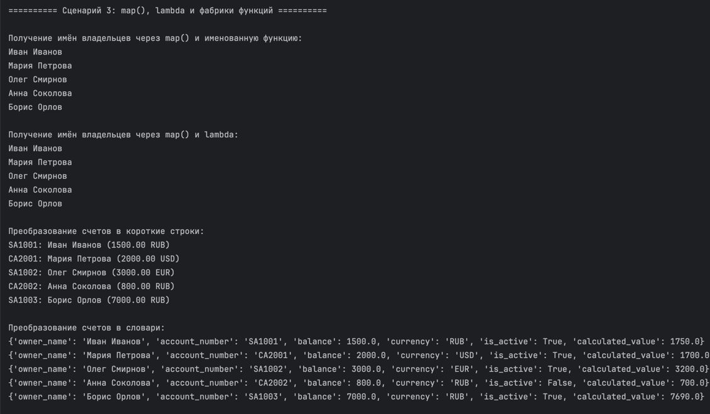
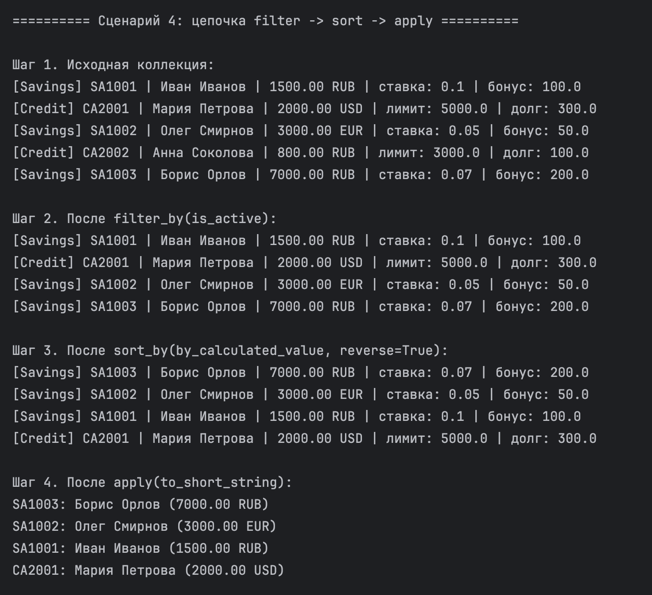
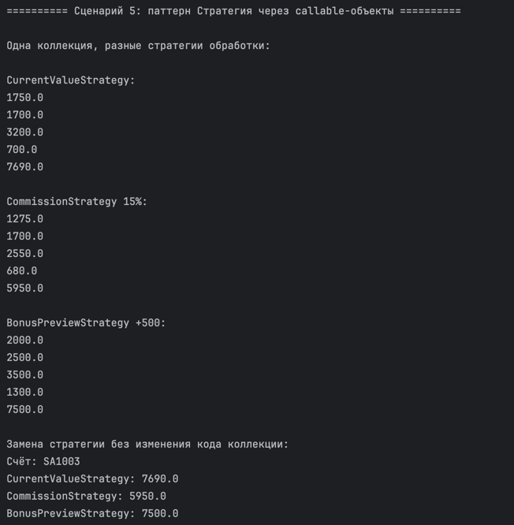
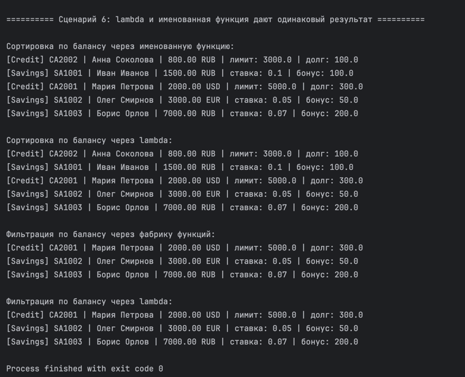

# ЛР-5 — Функции как аргументы. Стратегии и делегаты

## 1. Цель работы

Цель лабораторной работы:

- освоить передачу функций как аргументов в другие функции и методы;
- научиться использовать `map`, `filter`, `sorted`;
- понять применение `lambda`-выражений;
- реализовать фабрики функций;
- применить паттерн «Стратегия»;
- интегрировать функциональный стиль с объектно-ориентированным кодом из прошлых лабораторных работ.

---

## 2. Реализованные функции и стратегии

### 2.1. Функции-стратегии для сортировки

| Функция | Описание |
|---------|----------|
| `by_balance` | сортировка по текущему балансу |
| `by_owner_name` | сортировка по имени владельца |
| `by_currency_and_balance` | сортировка по валюте и балансу |
| `by_calculated_value` | сортировка по результату метода `calculate()` |

### 2.2. Функции-фильтры

| Функция | Описание |
|---------|----------|
| `is_active` | оставляет только активные счета |
| `is_savings_account` | оставляет только накопительные счета |
| `is_credit_account` | оставляет только кредитные счета |

### 2.3. Фабрики функций

| Фабрика | Описание |
|---------|----------|
| `make_min_balance_filter(min_balance)` | создаёт фильтр счетов с балансом не меньше заданного |
| `make_balance_range_filter(min_balance, max_balance)` | создаёт фильтр по диапазону баланса |
| `make_commission_applier(percent)` | создаёт функцию расчёта баланса после комиссии |

Фабрика функций — это функция, которая создаёт и возвращает другую функцию.

### 2.4. Функции для `map()`

| Функция | Описание |
|---------|----------|
| `get_owner_name` | возвращает имя владельца |
| `to_short_string` | преобразует счёт в короткую строку |
| `to_dict` | преобразует счёт в словарь |

### 2.5. Callable-объекты и паттерн «Стратегия»

Реализованы callable-стратегии:

| Стратегия | Описание |
|-----------|----------|
| `CurrentValueStrategy` | возвращает расчётное значение счёта |
| `CommissionStrategy` | рассчитывает баланс после комиссии |
| `BonusPreviewStrategy` | показывает баланс с дополнительным бонусом |

Стратегии реализованы через метод `__call__`, поэтому их можно передавать туда же, куда передаются обычные функции.

### 2.6. Методы коллекции

В класс `FunctionalBankAccountCollection` добавлены методы:

| Метод | Описание |
|-------|----------|
| `sort_by(key_func, reverse=False)` | сортирует коллекцию по переданной функции |
| `filter_by(predicate)` | возвращает новую коллекцию по условию |
| `apply(func)` | применяет функцию ко всем объектам коллекции |

---

## 3. Демонстрация работы

### Сценарий 1: Сортировка тремя стратегиями

Что происходит:
- создаётся коллекция банковских счетов разных типов;
- выполняется сортировка через `sorted()` и `key=`;
- выполняется сортировка через метод коллекции `sort_by()`;
- применяются разные функции-стратегии сортировки.

Демонстрируется:
- сортировка по балансу;
- сортировка по имени владельца;
- сортировка по валюте и балансу одновременно.

Результат:
одна и та же коллекция сортируется разными способами без изменения кода коллекции.

---

### Сценарий 2: Фильтрация через `filter()`

Что происходит:
- применяется встроенная функция `filter()`;
- в неё передаются разные функции-фильтры;
- отбираются активные, накопительные и кредитные счета.

Демонстрируется:
- передача функции как аргумента;
- использование `filter()`;
- фильтрация по состоянию объекта;
- фильтрация по типу объекта.

Результат:
одна коллекция может быть отфильтрована разными способами с помощью разных функций.

---

### Сценарий 3: `map()`, `lambda` и фабрики функций

Что происходит:
- применяется `map()` для получения имён владельцев;
- применяется `map()` для преобразования счетов в строки;
- применяется `map()` для преобразования объектов в словари;
- используется фабрика функций для создания фильтра по диапазону баланса;
- используется фабрика функции для расчёта комиссии.

Демонстрируется:
- `map()`;
- `lambda`;
- фабрики функций;
- замыкания;
- преобразование объектов без изменения исходной коллекции.

Результат:
объекты коллекции можно преобразовывать и обрабатывать функциональным способом.

---

### Сценарий 4: Цепочка операций `filter -> sort -> apply`

Что происходит:
- сначала выводится исходная коллекция;
- затем остаются только активные счета через `filter_by(is_active)`;
- затем они сортируются через `sort_by(by_calculated_value, reverse=True)`;
- затем каждый объект преобразуется через `apply(to_short_string)`.

Демонстрируется:
- последовательная обработка коллекции;
- цепочка операций;
- передача функций в методы коллекции;
- работа без изменения исходной коллекции.

Результат:
каждая операция принимает результат предыдущей, а код становится читаемым и гибким.

---

### Сценарий 5: Паттерн «Стратегия» через callable-объекты

Что происходит:
- создаются объекты стратегий:
  - `CurrentValueStrategy`;
  - `CommissionStrategy`;
  - `BonusPreviewStrategy`;
- каждая стратегия применяется к коллекции через `apply()`;
- одна и та же коллекция обрабатывается по-разному.

Демонстрируется:
- callable-объекты;
- метод `__call__`;
- паттерн «Стратегия»;
- замена стратегии без изменения кода коллекции.

Результат:
поведение программы меняется за счёт передачи другой стратегии.

---

### Сценарий 6: `lambda` и именованная функция

Что происходит:
- сортировка выполняется через именованную функцию `by_balance`;
- затем такая же сортировка выполняется через `lambda`;
- фильтрация выполняется через фабрику функций;
- затем такая же фильтрация выполняется через `lambda`.

Демонстрируется:
- что `lambda` и именованная функция могут давать одинаковый результат;
- когда лучше использовать именованную функцию;
- когда удобно использовать `lambda`.

Результат:
`lambda` удобна для короткой одноразовой логики, а именованные функции лучше подходят для переиспользования.

---

## 4. Вывод

В ходе лабораторной работы были изучены:

- передача функций как аргументов;
- функции высшего порядка;
- `map()`;
- `filter()`;
- `sorted()`;
- `lambda`-выражения;
- фабрики функций;
- замыкания;
- паттерн «Стратегия»;
- callable-объекты;
- цепочки операций над коллекцией;
- интеграция функционального подхода с ООП.