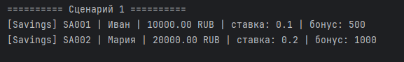
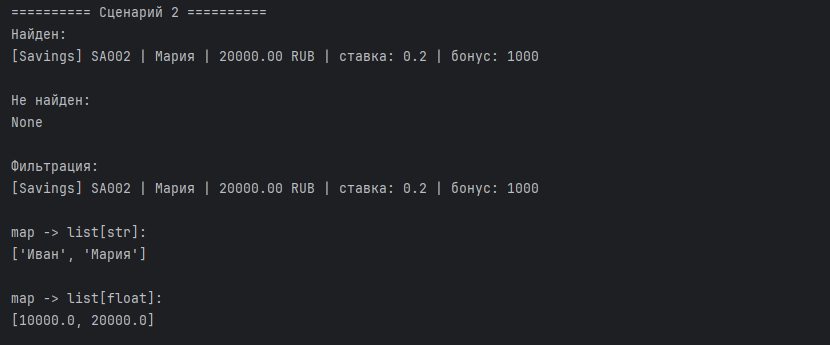
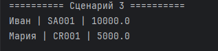
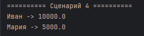

# ЛР-6 — Generics и typing

## 1. Цель работы

Цель лабораторной работы:

- освоить систему аннотаций типов в Python (`typing`);
- научиться создавать generic-классы через `TypeVar` и `Generic`;
- изучить структурную типизацию через `Protocol`;
- научиться использовать ограничения типов (`bound`);
- интегрировать типизацию с кодом предыдущих лабораторных работ.

---

## 2. Описание реализованных типов и контейнеров

### 2.1. Аннотации типов

Во все классы банковских счетов были добавлены аннотации типов:

- параметры конструктора;
- возвращаемые значения методов;
- атрибуты в `__init__`;
- типы коллекций;
- типы аргументов функций.

Пример:

```python
def score(self) -> float:
    return self.balance
```

Аннотации типов позволяют:

- сделать код более читаемым;
- получать подсказки IDE;
- заранее находить ошибки типов;
- улучшить поддержку и рефакторинг проекта.

---

### 2.2. Generic-класс `TypedCollection`

Реализован generic-класс:

```python
class TypedCollection(Generic[T])
```

Коллекция хранит объекты типа `T`.

Используемые `TypeVar`:

| TypeVar | Назначение |
|----------|-------------|
| `T` | основной тип элементов коллекции |
| `R` | тип результата метода `map()` |
| `D` | объекты с методом `display()` |
| `S` | объекты с методом `score()` |

---

### 2.3. Реализованные методы коллекции

| Метод | Описание |
|-------|----------|
| `add()` | добавление элемента |
| `remove()` | удаление элемента |
| `remove_at()` | удаление по индексу |
| `get_all()` | получение всех элементов |
| `find()` | поиск первого подходящего объекта |
| `filter()` | фильтрация элементов |
| `map()` | преобразование элементов |
| `sort_by()` | сортировка |
| `filter_by()` | фильтрация с возвратом новой коллекции |
| `apply()` | применение функции ко всем объектам |
| `__iter__()` | поддержка цикла |
| `__getitem__()` | доступ по индексу |
| `__len__()` | количество элементов |

---

### 2.4. Метод `map()` и изменение типа результата

Метод `map()` использует второй `TypeVar`:

```python
R = TypeVar("R")
```

Это позволяет менять тип результата:

```python
names: list[str]
balances: list[float]
```

Например:

```python
collection.map(lambda x: x.owner_name)
```

Из:

```python
TypedCollection[SavingsAccount]
```

получается:

```python
list[str]
```

---

### 2.5. Protocol и структурная типизация

Созданы два Protocol:

| Protocol | Требование |
|-----------|------------|
| `Displayable` | наличие метода `display()` |
| `Scorable` | наличие метода `score()` |

```python
class Displayable(Protocol):
    def display(self) -> str:
        ...
```

```python
class Scorable(Protocol):
    def score(self) -> float:
        ...
```

---

### 2.6. Ограничение типов через `bound`

Созданы ограничения:

```python
D = TypeVar("D", bound=Displayable)
S = TypeVar("S", bound=Scorable)
```

Теперь:

```python
TypedCollection[D]
```

может хранить только объекты с методом `display()`.

А:

```python
TypedCollection[S]
```

только объекты с методом `score()`.

---

### 2.7. Структурная типизация

Классы:

- `SavingsAccount`
- `CreditAccount`

не наследуются от `Displayable` или `Scorable`, но подходят под них, потому что имеют нужные методы.

Это и есть структурная типизация:

> если объект содержит нужные методы — он подходит под Protocol.

---

## 3. Демонстрация работы

### Сценарий 1: Generic-коллекция



Что происходит:

- создаётся `TypedCollection[SavingsAccount]`;
- в коллекцию добавляются объекты;
- выполняется вывод элементов через цикл.

Демонстрируется:

- Generic;
- TypeVar;
- хранение объектов одного типа;
- работа типизированной коллекции.

Результат:

коллекция безопасно хранит объекты `SavingsAccount`.

---

### Сценарий 2: Методы `find`, `filter`, `map`



Что происходит:

- вызывается `find()` для поиска объекта;
- вызывается `filter()` для фильтрации;
- вызывается `map()` для преобразования объектов.

Демонстрируется:

- `Callable`;
- `Optional`;
- Generic-методы;
- изменение типа результата через `map()`.

Результат:

- `find()` возвращает объект или `None`;
- `filter()` возвращает список объектов;
- `map()` может возвращать список строк и список чисел.

---

### Сценарий 3: Protocol `Displayable`



Что происходит:

- создаётся `TypedCollection[D]`;
- добавляются объекты разных классов;
- вызывается метод `display()`.

Демонстрируется:

- Protocol;
- структурная типизация;
- ограничение `bound=Displayable`.

Результат:

разные классы работают через общий Protocol без наследования.

---

### Сценарий 4: Protocol `Scorable`



Что происходит:

- создаётся `TypedCollection[S]`;
- вызывается метод `score()`;
- выводятся числовые оценки объектов.

Демонстрируется:

- второй Protocol;
- ограничение типов;
- работа generic-класса с разными ограничениями.

Результат:

один и тот же `TypedCollection` может работать с разными Protocol.

---

## 4. Вывод

В ходе лабораторной работы были изучены:

- аннотации типов;
- Generic и `TypeVar`;
- generic-классы;
- `Callable`;
- `Optional`;
- методы `find`, `filter`, `map`;
- изменение типа результата через `map()`;
- `Protocol`;
- структурная типизация;
- ограничения типов через `bound`;
- интеграция typing с объектно-ориентированным программированием.

Был реализован generic-класс `TypedCollection`, поддерживающий типизированную работу с коллекциями и структурную типизацию через `Protocol`.